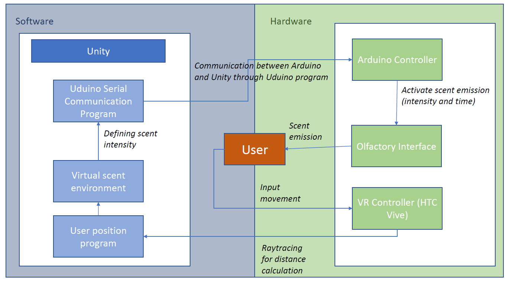
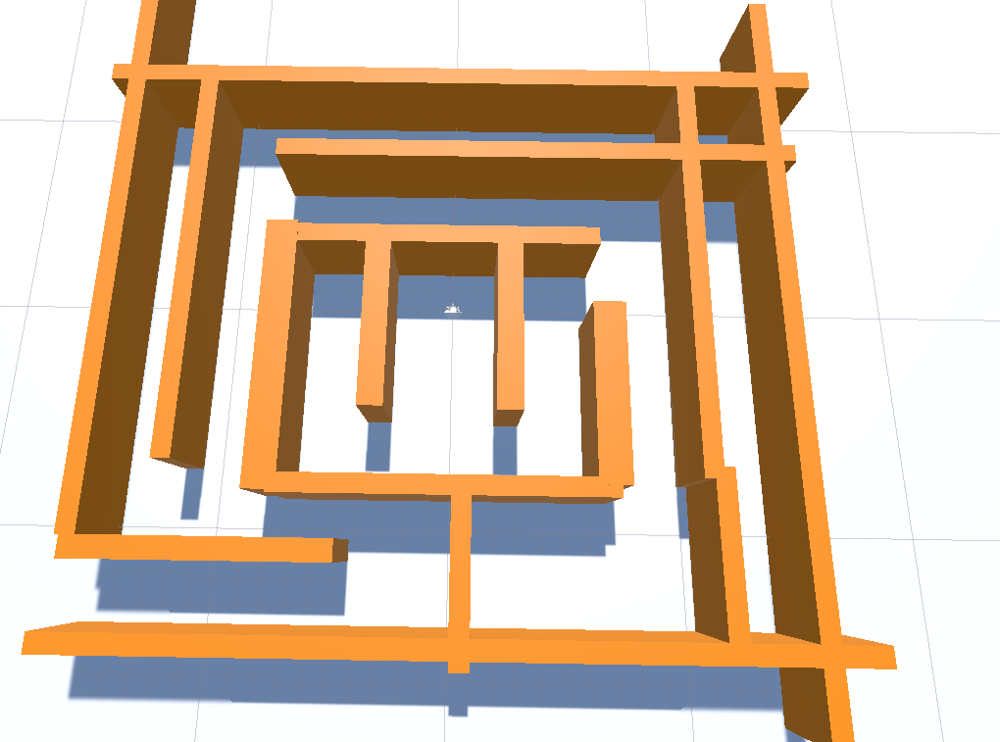
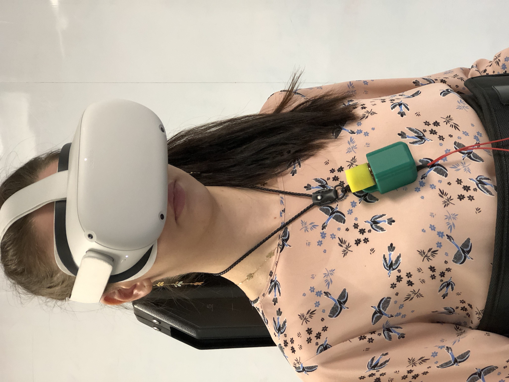

# Augmented-Olfactive-Interface-
This project aims at simulating smell diffusion in virtual environment and connect it to an olfactive interface to create immersive virtual reality experiences based on the user's position.

# Olfactive Interface

The olfactory interface is a wireless and portable scent releaser neckless. This device can be composed of one or several releaser modules for different smells. This interface can control independently the intensity and the frequency of each scent release. Such device offer new immersive experiences in Virtual Reality to push forward Tele-presence technologies

# Install 
Launch Unity Hub 
Install Unity Version 2020.3.20f1 or higher
Add modules to Unity 2020.3.20f1 : Android Build Support 
Launch a new project with Universal render Pipeline
Import Assets and project settings

# Setup Environment 
Activate Developper mode on Oculus Quest 2 settings
Setup Unity environment for VR interface with Oculus Quest 2 :
https://www.youtube.com/watch?v=F4gDjCLYX88

# Startup Project
To start the project, simply clock on lunch 
# Project Overview

As a way to asses how immersive, olfative interface combined with virtual reality could be, It is interested to study the impact of odors on user's navigation in a virtual environment.

Hypothesis : Smell improves user's navigation in virtual reality experiences.
Goal : Getting out of the maze.
The user will be placed in the middle of the maze \ref{fig:maze}. The user needs to find the way to the exit. 
The experiment uses different senses depending on which maze : 
- Maze 1 : Sight
- Maze 2 : Smell + Sight
- Maze 3 : Smell

The time spent and the number of dead end taken are counted.
A scent will be diffused from the exit and all along the right way. The intensity of this smell will vary based on the user's position in the maze : As the user is getting closer to the exit, the intensity of smell released increases. 

## Technical Setup

### Hardware
- 4D space : Oculus Quest 2, Cat VR Laptop (Dell xps 9510)
- Olfactory Interface (Scent diffusion system with driver circuit and Arduino)
### Software
- Unity 2020.3.20f1 (Virtual environment) 
- Package Uduino (Connect unity to Arduino

## Measures
- Execution time of the task : Time spent by the user in the maze before finding the exit (in minutes) (Objective/Quantitative)
- Number of wrong way taken by the user before finding the exit(Objective/Quantitative)
- User questionnaries : NASA Task Load IndexI
- Immersion in virtual reality on a scale (1-5) for the differents exper-iments (Sight,Sight and Smell, Smell) (Subjective/Quantitative)
- Why did you give this mark ? Lack of what to get to 5 ?
- Which experience is easier to archieve ? (Subjective/Qualitative)
- User’s feeling about the impact of odors on immersion in VR(Subjective/Qualitative)
- User’s feeling about the impact of odors on navigation in VR(Subjective/Qualitative
